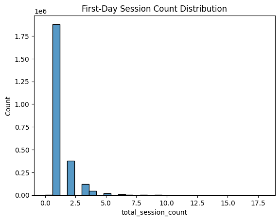
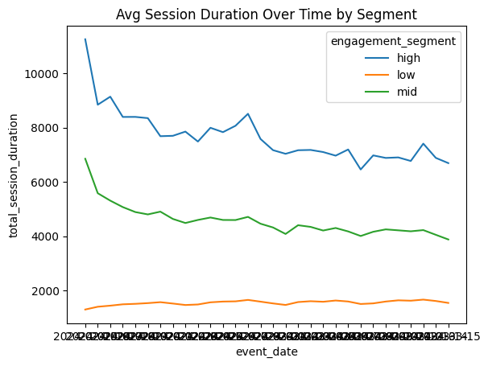
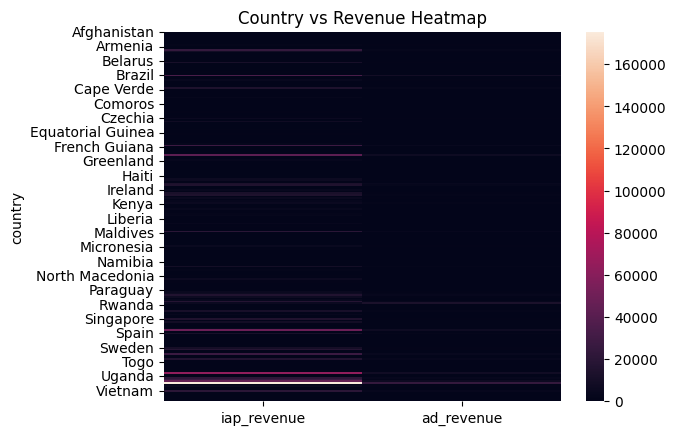
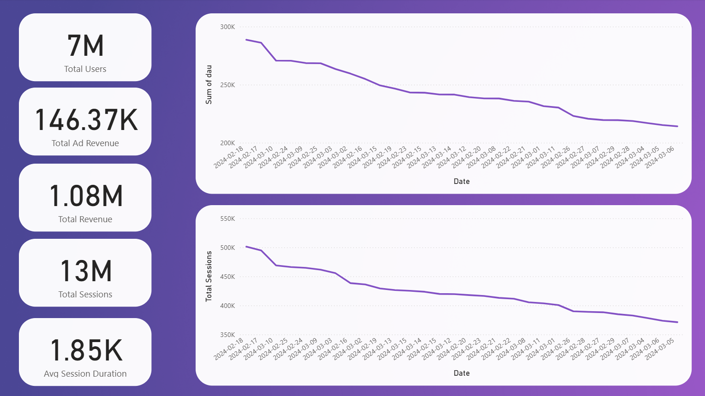
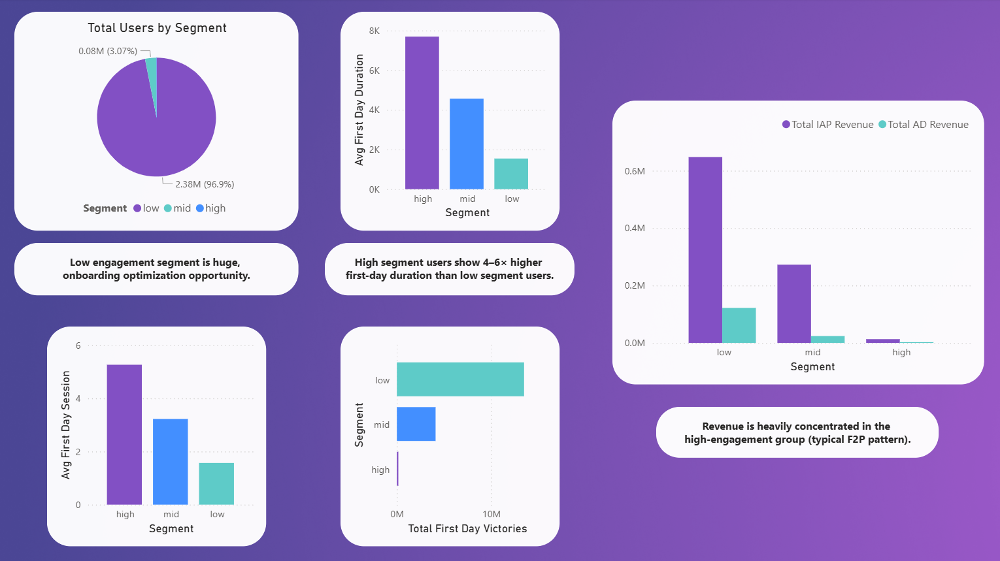
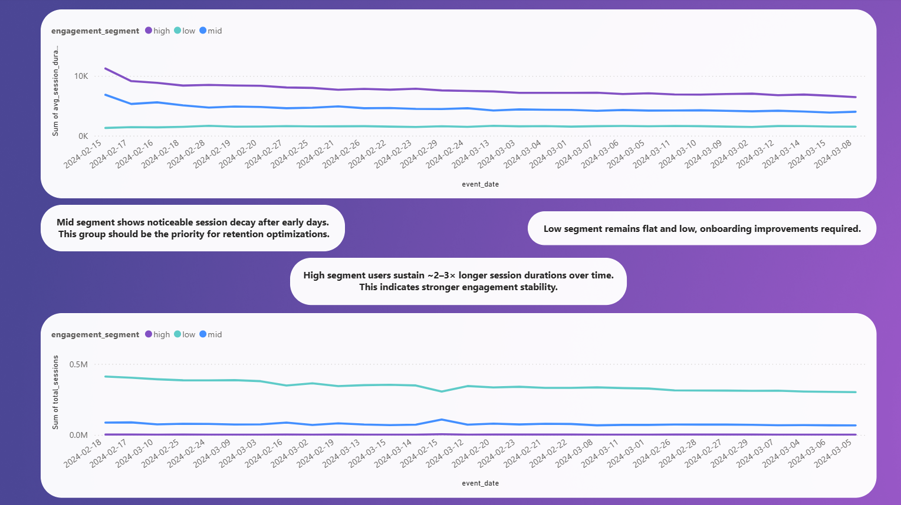

# README – Task 2

## Exploratory Analysis on User Engagement, Revenue, and Behavioral Trends
**Important note:** Due to GitHub’s file size limits, the enriched dataset and the full Power BI dashboard are hosted on Google Drive. You can access them here:
**[Google Drive Folder](https://drive.google.com/drive/folders/14D0qEPHDG6Vh_eQL1T2wvSoKbSyg5xGR?usp=drive_link)**

---

## 1. Purpose of Task 2

This part of the case is about understanding how players behave in the first days of the game and how this behavior links to engagement and revenue later on.

I grouped players by simple activity levels, checked how their playtime changed over time, and compared which groups brought in more value.

The workflow was:

- **Python** — clean the data and run basic checks  
- **SQL** — create views for segments, activity, and revenue  
- **Power BI** — visualize the results and show the main patterns  

The goal was to build a clear and easy-to-follow structure that explains player behavior without using complex methods.

---

## 2. Dataset Overview

The dataset includes daily records for each player.  
It covers platform, country, number of sessions, playtime, install dates, and revenue data from both IAP and ads.

With this structure, I was able to:

- Group players based on early activity  
- Track how their sessions changed over time  
- Look at basic retention patterns  
- Compare revenue across segments and countries  

---

## 3. Folder Structure & File Contents

Below is the folder structure I used for Task 2:

```
/task2
    /sql
        vw_country_revenue.sql
        vw_daily_activity_by_segment.sql
        vw_first_day_conversion.sql
        vw_revenue_by_segment.sql
        vw_session_fatigue_analysis.sql
        vw_user_segments.sql

    /python
        01_data_cleaning.ipynb
        02_feature_engineering.ipynb
        03_exploratory_analysis.ipynb

    /images
        firstpage.png
        secondpage.png
        thirdpage.png
        revenuebysegment.png
        heatmap.png
        avgsessionduration.png
        sessiondistribution.png
```

---

## 4. Python

Python was the first step of the workflow.  
I used it to clean the data, create simple features, and check the main patterns before moving into SQL and Power BI.

---

### 1. Data Cleaning  
**Notebook:** `01_data_cleaning.ipynb`

- Fixed column types  
- Replaced missing revenue values  
- Removed rows with impossible session data  
- Exported a clean dataset for SQL

**Quick Check:**  


Most players only play 1–2 sessions on Day 1, which shows why segmentation was needed.

---

### 2. Feature Engineering  
**Notebook:** `02_feature_engineering.ipynb`

Main fields created:

- `engagement_segment`  
- `total_revenue`  
- Day-1 activity flags  
- Average duration per session  

**Quick Check:**  


High-engagement players bring the most revenue per user.  
This supported the segment structure used later.

---

### 3. Early Exploratory Analysis  
**Notebook:** `03_exploratory_analysis.ipynb`

**a) Session Fatigue**  
  
Session duration drops over time for all segments. High segment stays the most stable.

**b) Country Revenue**  
  
A small group of countries generates most revenue.

---

### 4. Why Python Was Used

- To prepare a clean dataset for SQL  
- To test segment logic early  
- To confirm basic behavior patterns  
- To guide how the Power BI dashboards should be structured

This kept the whole analysis clear and easy to maintain.

---

## 5. SQL Layer

The SQL layer groups the main behaviors and revenue patterns into simple views.  
Each view focuses on one question and keeps the analysis easy to follow.

---

### 5.1 vw_country_revenue.sql
Shows how much revenue each country brings in (IAP + Ads).  
Useful for seeing which regions contribute the most.

---

### 5.2 vw_user_segments.sql
Places each player into a low, mid, or high engagement group based on their Day-1 activity.  
This creates the foundation for all segment-based comparisons.

---

### 5.3 vw_first_day_conversion.sql
Checks whether players who are active on Day 1 also spend more later on.  
Helps link early behavior to long-term revenue.

---

### 5.4 vw_daily_activity_by_segment.sql
Tracks day-by-day activity for each segment, including sessions, playtime, and match counts.  
Shows how each group behaves over time, not just on the first day.

---

### 5.5 vw_session_fatigue_analysis.sql
Measures how average session duration declines across days.  
Gives a clear view of session fatigue for each segment.

---

### 5.6 vw_revenue_by_segment.sql
Breaks down total revenue by engagement segment.  
Helps compare low, mid, and high groups in a simple and consistent way.

---

## 6. Dashboard Pages & Interpretations

---

## Dashboard Page 1 – Overall Activity & Engagement Trends  


### What This Page Shows
This page gives a general view of the player base and their activity:

- **7M users**
- **13M sessions**
- **1.08M total revenue**
- **146K ad revenue**
- **1.85K seconds (≈30 minutes) avg session duration**

It also shows two main trends:

- **DAU over time**
- **Total sessions over time**

---

### Key Insights
- **DAU and sessions decrease slowly**, which points to normal fluctuations.   
- The overall pattern fits a **typical casual mobile game** stable behavior with no sudden drops.

---

### Why This Matters
This page shows the general health of the game.  
The smooth decline with no sudden spikes or crashes create a solid base for the rest of the analysis, especially for understanding segments and revenue in the next pages.

---

## Dashboard Page 2 – First-Day Engagement Segments  


### What This Page Shows
This page groups players into **low**, **mid**, and **high** engagement segments using their Day-1 session count and playtime.  
It compares these groups by:

- Player count  
- First-day duration  
- First-day sessions  
- Day-1 victories  
- Total revenue (IAP + Ads)

---

### Key Insights

#### 1. Segment Size Is Very Uneven
- **Low = 96.9%** of all players  
- Mid and high groups are very small  
- Small improvements in the low group can affect the whole game

#### 2. Engagement Gaps Are Large
- High players play **much longer** and **much more** on Day-1
- Total first-day victories are highest in the low segment simply because this group is the largest
- Strong early activity usually turns into stronger long-term value

#### 3. Revenue: low leads in total, high leads per user
- Low group generates the highest total revenue because it covers ~97% of players
- High group brings the **highest revenue per user**  
- Ad revenue shows the same structure: volume from low, efficiency from high 
- A small high-engagement group is very valuable on a per-user basis, but most money still comes from the large low segment

#### 4. Mid Players Are the Main Opportunity
- They have solid activity but not at the “high” level  
- They respond well to small improvements  
- Good target for retention and early-game tuning

---

### Why This Matters
Day-1 behavior is one of the clearest signals for future performance.  
This page shows which groups are stable, which ones can grow, and where early-game improvements will have the biggest impact:

- **High** players stay valuable  
- **Mid** players can improve with better support  
- **Low** players show signs of onboarding friction  

These insights guide where to focus retention and early-game design efforts.

---

## Dashboard Page 3 – Session Fatigue & Segment Behavior Over Time  


### What This Page Shows
This page shows how **session duration** and **total sessions** change over time for low, mid, and high engagement groups.

---

### Key Insights

#### 1. High Segment Stays Strong
- 2–3× longer sessions  
- Slow decline  
- Most consistent long-term group

#### 2. Mid Segment Drops Quickly
- Early and noticeable decline  
- Very sensitive to pacing  
- Best target for retention work

#### 3. Low Segment Shows Weak Engagement
- Short, flat session duration  
- No real improvement  
- Points to onboarding issues

#### 4. Total Sessions Follow the Same Trend
- Low = high totals only because of size  
- Mid = early drop  
- High = steady and predictable

---

### Why This Matters
This page helps identify where engagement weakens:

- High players keep playing  
- Mid players lose interest early  
- Low players never fully engage  

These patterns guide where to focus early-game improvements and retention efforts.

---

## 7. Methodology

This project uses **Python**, **SQL**, and **Power BI** together in a simple and clear workflow.  
Each step has its own role and keeps the analysis easy to manage.

---

### 1. Python – Cleaning, Basic Features, Early Checks

I worked with three notebooks:

- `01_data_cleaning.ipynb`  
  Fixed types, handled missing revenue, removed invalid rows, and prepared a clean dataset.

- `02_feature_engineering.ipynb`  
  Created key fields such as engagement segments, total revenue, and Day-1 activity flags.

- `03_exploratory_analysis.ipynb`  
  Generated quick plots to check session patterns, activity trends, and early revenue signals.

Python made sure the data was reliable before moving into SQL.

---

### 2. SQL – Structured Views for Behavior and Revenue

Each view focuses on one task:  
country revenue, first-day activity, engagement segments, session fatigue, and revenue by segment.

The enriched Python output feeds directly into these views.  
All SQL files are stored in `/task2/sql`.

---

### 3. Power BI – Final Visual Layer

I created three dashboard pages:

1. Overall activity and global metrics  
2. First-day engagement segments  
3. Session fatigue and segment behavior  

All exports are in `/task2/images`, matching the Power BI file.

Power BI reads the SQL views, which are built on top of the cleaned Python dataset.

---

### 4. End-to-End Workflow Summary

1. Python prepares and checks the data  
2. SQL organizes it into clear views  
3. Power BI visualizes the main patterns  
4. The README explains the overall approach  

This structure keeps the analysis simple, reusable, and easy to understand.

---

## 8. Assumptions

- Missing revenue is treated as zero.  
- Day-based activity is used as the main signal for engagement.  
- No seasonality or external events were considered.  
- User segments stay the same during the analysis period.  
- Revenue is counted on the day it appears in the data.

---

## 9. Key Findings

1. Day-1 activity is the clearest indicator of long-term value.  
2. High-engagement players lead retention and revenue per user, while the low segment generates the highest total revenue due to its size.
3. All groups show session fatigue, which should guide pacing decisions.  
4. Revenue differs strongly by country and is easy to act on.  
5. Simple segments help explain behavior and support future analysis.

---

## 10. Final Notes

Task 2 can be repeated end-to-end.  
SQL views keep the logic organized, and Power BI shows the main patterns clearly.  
All insights come directly from the dataset, without extra assumptions.
